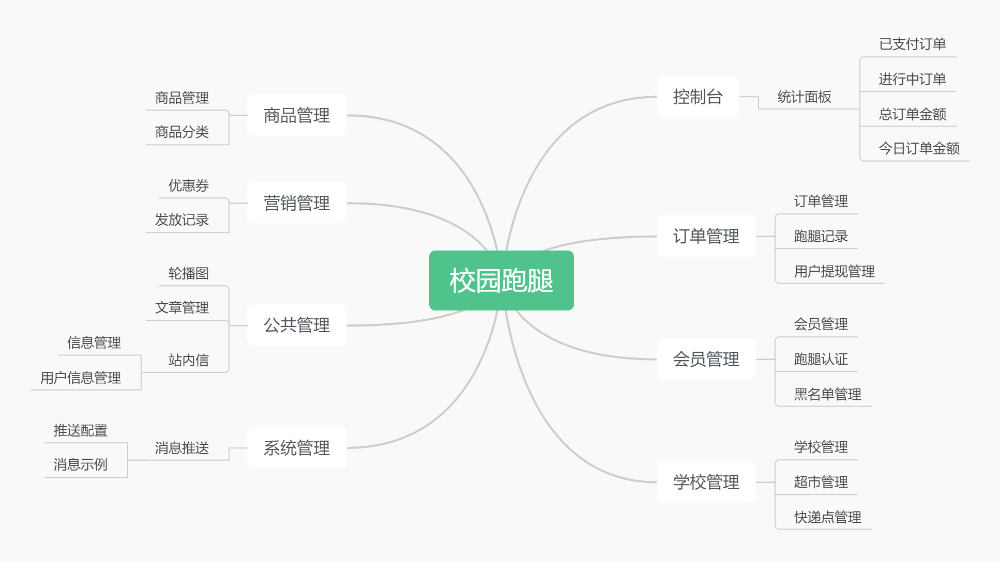
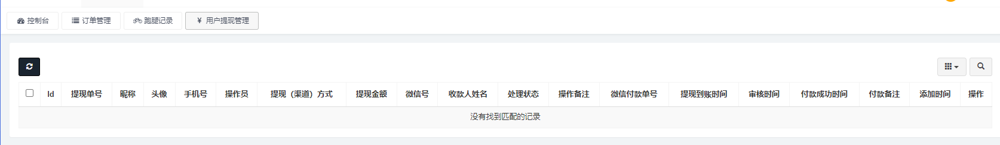
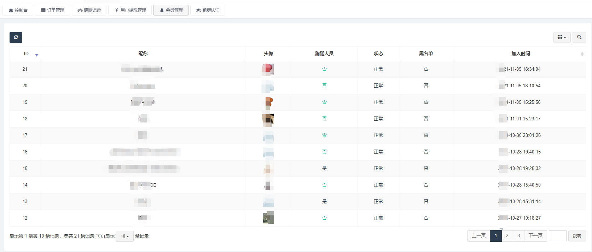
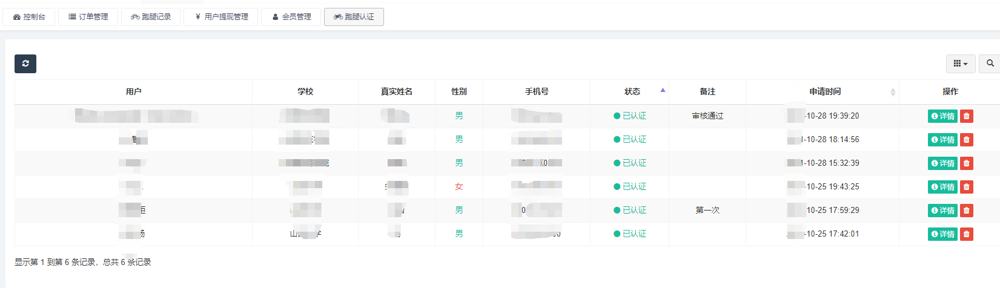

# 校园跑腿管理系统

## 一、介绍

简易的校园内跑腿管理系统

## 二、技术选型

1. HTML + CSS + JavaScript
2. PHP 7.4
3. MySQL 5.7
4. Nginx

## 三、实现功能

1. 统计面板
   1. 已支付订单
   2. 进行中订单
   3. 总订单金额
   4. 今日订单金额
2. 订单管理
   1. 订单管理
   2. 跑腿记录
   3. 用户提现管理
3. 会员管理
   1. 会员管理
   2. 跑腿认证
   3. 黑名单管理
4. 学校管理
   1. 学校管理
   2. 超市管理
   3. 快递点管理
5. 商品管理
   1. 商品管理
   2. 商品分类
6. 营销管理
   1. 优惠券
   2. 发放记录
7. 公共管理
   1. 轮播图
   2. 文章管理
   3. 站内信
      1. 信息管理
      2. 用户信息管理
8. 系统管理
   1. 消息推送
      1. 推送配置
      2. 消息示例

## 四、系统平台功能过导图

后台功能界面展示

需要的联系，低价出售，私信联系我！！

系统、游戏、运维、技术支持均可联系！！
